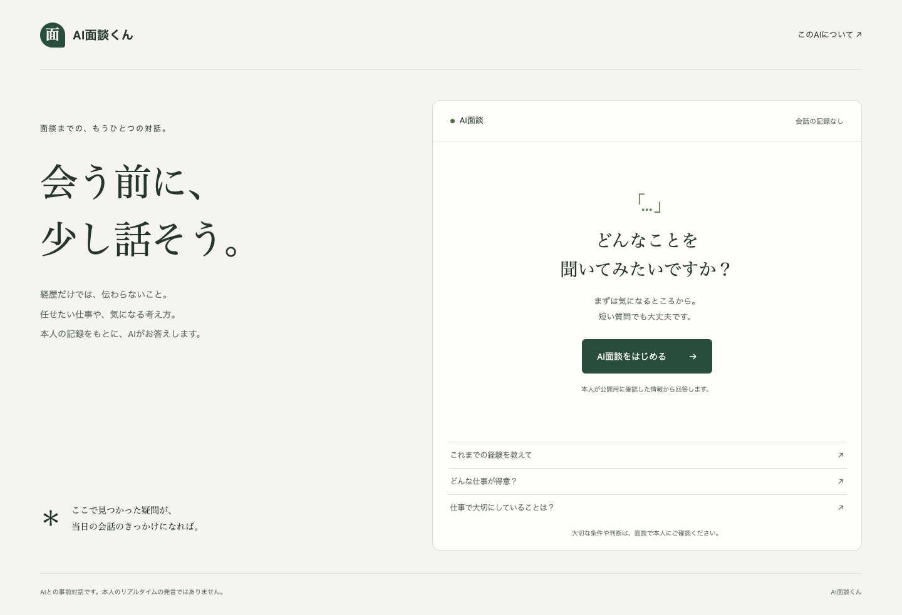
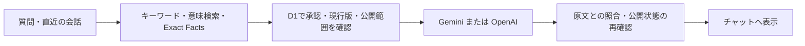

# AI面談くん

**会う前に、少し話そう。**

本人が公開用に承認した情報をもとに、経歴や仕事の経験について質問できるAIチャットです。面談前に気になる点を整理し、当日の会話につなげることを目指しています。

[MIT License](LICENSE) · [セットアップ](docs/setup/README.md) · [開発手順](docs/development_workflow/README.md)



> **現在はP0検証版です。** 文字チャットと承認済みデータの検索・回答を実装しています。本人データは配布していないため、実際にAIへ質問するには自分の環境とデータの設定が必要です。

## できること

- **会話しながら経験を知る** — 直前の会話を踏まえた質問、ストリーミング表示、回答停止に対応。
- **質問のきっかけを選ぶ** — 18種類の候補から常に3つを表示。候補の入れ替えにはAI APIを使いません。
- **承認済みの情報から答える** — 公開範囲、承認、現行版、検索準備の状態を確認してから回答に使います。
- **数字や担当範囲を保持する** — 原文の段落と照合し、但し書き・否定・時点を落とさない方式です。
- **分からないことを扱う** — 回答できる範囲、不明点、質問の曖昧さを区別します。
- **会話を保存せずに試す** — アプリは会話本文をDBやブラウザstorageへ保存しません。外部AIサービスの保持条件は別途適用されます。

## 仕組み

質問に関連する承認済みの情報を検索し、その情報をAIへ渡して回答します。この方式はRAG（検索を組み合わせた生成）と呼ばれます。検索結果だけで公開可否を判断せず、D1の現在の承認状態を確認します。



| 部分 | 技術・役割 |
| --- | --- |
| 画面 | Next.js / React / CSS。日本語IMEとスマホ表示に対応 |
| API | Cloudflare Workers / OpenNext |
| 本文と状態管理 | Cloudflare D1 / SQLite FTS5 |
| 意味検索 | Cloudflare Vectorize |
| AI | Gemini / OpenAI Adapter。回答とEmbeddingを別々に選択 |
| 検証 | Node.jsのテスト、Playwright＋Google Chrome |

回答モデルだけを変える場合、Embeddingを維持すれば本人データの再登録は不要です。Embeddingモデルを変える場合は検索indexの再構築が必要です。他社への自動fallbackは行いません。

## まず画面を動かす

Node.js **22.18以上**とnpmを使用します。

```sh
git clone https://github.com/ryoheiwatanabe/ai-mendan-kun.git
cd ai-mendan-kun
npm ci
cp -n wrangler.template.jsonc wrangler.jsonc
npm run dev
```

[http://127.0.0.1:3000](http://127.0.0.1:3000)で初期画面を確認できます。この段階ではCloudflare・APIキー・本人データが未設定のため、質問に実AIの回答は返りません。既存の`wrangler.jsonc`をテンプレートで上書きしないでください。

**実際にAIで回答するには**、CloudflareのWorkers・D1・Vectorizeと、GeminiまたはOpenAIのAPIキーが必要です。[詳しいセットアップ手順](docs/setup/README.md)に、リソース作成、Secret登録、データ承認・投入、実API評価をまとめています。APIの利用料は各サービスの条件に従います。

## 検証する

```sh
npm test
npm run typecheck
npm run test:e2e
npm run build:worker
```

2026-09-10時点の確認結果：

| 確認 | 結果・範囲 |
| --- | --- |
| コアテスト | 48件通過。公開状態、版の切替、数値・担当範囲、検索、入力制限など |
| ブラウザテスト | 10件通過。320 / 375 / 414 / 768 / 1440px、IME、3往復後の候補表示、失敗からの復帰など |
| Workerビルド | 型チェックを含め通過 |

ブラウザテストは既存のGoogle Chromeを使用します。テスト用の架空データと通信の置き換えを使うため、上記のテストで実AI APIは呼びません。実際の回答品質は、本人が確認したデータと評価セットで別途検証します。

## プライバシーと公開範囲

このリポジトリに含めるのは、ソースコード、テスト、汎用テンプレート、ドキュメントです。個人のプロフィール・履歴書、承認記録、会話本文、APIキー、実環境のDB IDは含めません。

- 会話はタブのメモリに保持し、終了・再読み込み・タブを閉じると破棄します。
- 直近6往復・合計5,500文字までを会話の文脈として送ります。停止・失敗した回答は次の質問の履歴から除きます。
- 質問・履歴・公開用の根拠は、処理のためにCloudflareと選択したAI Providerへ送信します。アプリ内の非保存と、外部サービスの保持条件は別です。
- 利用制限用D1には、日ごとに変わるIP由来のhash・回数・失効時刻を保存します。生IPと会話本文は保存しません。期限切れ行は次回アクセス時に削除します。
- アプリSecretはWorkers Secretsで管理し、`.env`とその派生ファイル、`.dev.vars`は作成しません。

`data/`、`docs/project_context/`、`wrangler.jsonc`、`.local/`、生成物、認証・環境ファイルはGit対象外です。共有用設定は`wrangler.template.jsonc`、データの書式は`examples/`を使います。PR本文やスクリーンショットにも個人情報を含めないよう確認してください。

## 設計上の判断と現在の制約

P0では、事実の文章を承認済みの完全な段落から選んでいます。数字や担当範囲を保持しやすい一方、回答が長く硬くなることがあります。自由な言い換えの自然さは今後の改善対象です。

- 根拠が見つからない場合の案内と、質問候補が回答できる範囲に合っているかは改善中です。
- AIによる解釈は、適性・相性などを明示的に尋ねた場合だけラベル付きで許可します。意味的な妥当性を機械照合だけで保証できません。
- Exact Factsは現在・単年・明示日付を扱います。複数期間の比較や月単位の変化は未拡張です。
- 検索の重み・しきい値と回答品質は、利用する本人データでの評価が必要です。
- 利用回数制限は費用抑制の補助です。分散攻撃や同じネットワークの利用者を完全には区別できません。
- トークン使用量は現在、画面やDBへ記録していません。

管理画面、Notion同期、質問箱、Feedback、永続会話ログ、音声、映像は未実装です。

## 開発と貢献

変更はブランチで作業し、PRへ目的・差分・検証結果・レビュー内容を残してからmainへ取り込みます。[開発手順](docs/development_workflow/README.md)と[PRテンプレート](.github/pull_request_template.md)を参照してください。不具合報告には再現手順を添え、本人資料やSecretを貼り付けないでください。

このプロジェクトは生成AIを使って開発しています。要件や受け入れの判断と、AIによる実装・検証・Git操作の分担をPRに記録し、人のレビューとAIのレビューを区別します。初回P0実装をまとめて登録した後、PRによる変更管理を開始しています。

## ライセンス

ソースコードと付属ドキュメントは[MIT License](LICENSE)で提供します。商用利用、改変、再配布が可能で、著作権表示とライセンス文の保持が必要です。無保証で提供されます。

依存パッケージにはそれぞれのライセンス、外部サービスにはそれぞれの利用条件が適用されます。個人ごとに投入するデータはこのリポジトリの配布物に含まれません。

参考：[OpenNext](https://opennext.js.org/cloudflare)、[Cloudflare RPC](https://developers.cloudflare.com/workers/runtime-apis/bindings/service-bindings/rpc/)、[Vectorize](https://developers.cloudflare.com/vectorize/reference/client-api/)、[Gemini API](https://ai.google.dev/gemini-api/docs)。
