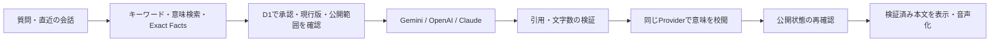

# AI面談くん

**会う前に、少し話そう。**

本人が公開用に承認した情報をもとに、経歴や仕事の経験について質問できるAIチャットです。面談前に気になる点を整理し、当日の会話につなげることを目指しています。

[MIT License](LICENSE) · [セットアップ](docs/setup/README.md) · [音声面談](docs/voice/README.md) · [開発手順](docs/development_workflow/README.md) · [回答の生成・校閲](docs/grounded_conversation/README.md)


> **現在は検証版です。** 文字チャットと承認済みデータの検索・回答に加え、任意で有効にする音声面談を実装しています。Phase 1の本人確認とPhase 2全体の受け入れは未完了です。本人データは配布していないため、実際にAIへ質問するには自分の環境とデータの設定が必要です。

## できること

- **会話しながら経験を知る** — 直前の会話を踏まえた質問、校閲後の回答表示、回答停止に対応。
- **質問のきっかけを選ぶ** — 18種類の候補から常に3つを表示。候補の入れ替えにはAI APIを使いません。
- **承認済みの情報から答える** — 公開範囲、承認、現行版、検索準備の状態を確認してから回答に使います。
- **数字や担当範囲を保持する** — 原文の引用に加え、引用箇所を示した要約・言い換えに対応します。生成後に同じAI Providerで意味を校閲し、公開状態も再確認します。経歴概要には、元資料を確認した短い紹介文を任意で設定できます。
- **分からないことを扱う** — 回答できる範囲、不明点、質問の曖昧さを区別します。
- **検索の参考値を表示する** — 「回答のヒット率を表示」をオンにすると、完了した回答の末尾に検索類似度を表示します。文字・音声両方の画面で使用でき、本番でも初期状態はオフです。
- **会話を保存せずに試す** — 通常の公開アプリは会話本文をDBやブラウザstorageへ保存しません。依頼を受けて記録用proxyを使うローカル検証では、会話・マイク音声・受信した回答音声をPCへ保存します。外部AIサービスの保持条件は別途適用されます。
- **声で面談する（任意設定）** — 同じ検索・回答に音声認識とStreaming音声を追加。発話終了、相槌、割り込み、待機中の補助音声、First Audio計測に対応します。標準合成声を使用します。

## 仕組み

質問に関連する承認済みの情報を検索し、その情報をAIへ渡して回答します。この方式はRAG（検索を組み合わせた生成）と呼ばれます。検索結果だけで公開可否を判断せず、D1の現在の承認状態を確認します。



| 部分 | 技術・役割 |
| --- | --- |
| 画面 | Next.js / React / CSS。日本語IMEとスマホ表示に対応 |
| API | Cloudflare Workers / OpenNext |
| 本文と状態管理 | Cloudflare D1 / SQLite FTS5 |
| 意味検索 | Cloudflare Vectorize |
| AI | 回答はGemini / OpenAI / Claude。検索用EmbeddingはGemini / OpenAIを別々に選択 |
| 音声 | Gemini STT / Streaming TTS、AudioWorklet、WebAudio。初期状態は無効 |
| 検証 | Node.jsのテスト、Playwright＋Google Chrome |

一般質問では回答生成と校閲を通常1回ずつ行います。修復生成は最大1回で、回答生成・校閲はそれぞれ最大2回、追加検索は最大1回です。校閲前の本文は表示・音声化しません。文字・音声画面には、本人の承認済み情報からAIが回答を生成している旨を常に表示します。

回答モデルだけを変える場合、Embeddingを維持すれば本人データの再登録は不要です。Embeddingモデルを変える場合は検索indexの再構築が必要です。他社への自動fallbackは行いません。

### 「回答のヒット率」の意味

開発時の検索確認に使う参考値で、正答率・質問に答えた割合・AIの自信ではありません。回答として送信した事実の原文に一致し、送信前の承認確認を通った根拠について、Vectorizeが返した検索類似度の最大値を100倍し整数へ丸めます。[セットアップ](docs/setup/README.md)のcosine indexを前提とし、0〜1の有限なスコアだけを表示に使用します。[Cloudflareの説明](https://developers.cloudflare.com/vectorize/best-practices/create-indexes/)にもあるとおり、ベクトルの近さが内容の正しさを保証するわけではありません。

続きの質問では、直前の質問と回答を検索の手掛かりに使う場合があります。履歴自体を事実の根拠にはしません。一部だけ回答できた場合の数値は、回答した部分の根拠だけが対象です。Exact Factsだけの回答、要約・言い換え・AIによる解釈を含む回答、対応するスコアのない回答、情報不足・曖昧な質問への案内は「算出対象外」と表示し、便宜的な0%や100%は付けません。停止・失敗・生成途中の回答には指標を表示しません。

表示はトグルで過去の回答もまとめて切り替えられ、追加のAI処理・検索・DB問い合わせは発生しません。数値は完了イベントの付加情報として返し、回答本文・会話履歴・音声読み上げには混ぜません。トグルと数値は画面のメモリだけに保持し、再読み込みでリセットします。指標は検索時点の値であり、現在の根拠の公開状態を証明するものではありません。

## まず画面を動かす

Node.js **22.18以上**とnpmを使用します。

```sh
git clone https://github.com/ryoheiwatanabe/ai-mendan-kun.git
cd ai-mendan-kun
npm ci
cp -n wrangler.template.jsonc wrangler.jsonc
npm run dev
```

[http://127.0.0.1:3000](http://127.0.0.1:3000)で初期画面を確認できます。この段階ではCloudflare・APIキー・本人データが未設定のため、質問に実AIの回答は返りません。既存の`wrangler.jsonc`をテンプレートで上書きしないでください。

**実際にAIで回答するには**、CloudflareのWorkers・D1・Vectorizeと、回答に使うGemini・OpenAI・ClaudeのいずれかのAPIキーが必要です。検索用EmbeddingはGemini・OpenAIに対応しており、**回答をClaudeにする場合は検索用のAPIキーも必要**です。[詳しいセットアップ手順](docs/setup/README.md)に、Providerの選択、リソース作成、Secret登録、データ承認・投入、実API評価をまとめています。他のAIサービスはAdapterの追加で拡張できます。APIの利用料は各サービスの条件に従います。

## 検証する

```sh
npm test
npm run typecheck
npm run test:e2e
npm run build:worker
```

2026-09-15の今回の変更に対する確認結果：

| 確認 | 結果・範囲 |
| --- | --- |
| コアテスト | 267件通過。公開状態、引用・校閲、検索類似度、Providerの通信形式、撤回・中断、WAV、費用制限、D1上限など |
| ブラウザテスト | 音声45件通過。相槌・割り込み・停止競合・連続再生・進行表示など。全ブラウザテストの再実行はしていません |
| 型チェック・Workerビルド | 通過 |

ブラウザテストは既存のGoogle Chromeを使用します。テスト用の架空データと通信の置き換えを使うため、上記のテストで実AI APIは呼びません。実際の回答品質は、本人が確認したデータと評価セットで別途検証します。今回の実APIの20問評価で発見した問題を修正し、対象質問を再確認しました。テスト通過や校閲合格は、すべての回答の正しさを保証するものではありません。

Claude接続の検証は、公式の通信仕様に基づくダミー応答と既存の検索・回答処理を組み合わせて行っています。実際のClaude APIへの接続と回答品質は未検証です。

音声APIは個人情報を含まない1.72秒の日本語合成音声で生成・認識を確認し、Chromeの偽マイクから実AudioWorkletで収音・変換したWAVの認識も確認しました。手元のマイクを使った会話でも検証を続けていますが、長時間の安定性や1.5秒以内の応答は受け入れ完了としていません。[音声の設定・検証結果・残る条件](docs/voice/README.md)を参照してください。

## プライバシーと公開範囲

このリポジトリに含めるのは、ソースコード、テスト、汎用テンプレート、ドキュメントです。個人のプロフィール・履歴書、承認記録、会話本文、APIキー、実環境のDB IDは含めません。

以下は通常の公開アプリの動作です。

- 会話はタブのメモリに保持し、終了・再読み込み・タブを閉じると破棄します。
- 直近6往復・合計5,500文字までを会話の文脈として送ります。停止・失敗した回答は次の質問の履歴から除きます。
- 質問・履歴・公開用の根拠は、処理のためにCloudflareと選択したAI Providerへ送信します。アプリ内の非保存と、外部サービスの保持条件は別です。
- 音声を有効にした場合、録音と検証済みの回答文を処理のためGoogleへ送ります。音声APIには`store:false`を指定し、録音や生成音声はアプリへ永続保存しません。
- 利用制限用D1には、日ごとに変わるIP由来のhash・回数・失効時刻を保存します。生IPと会話本文は保存しません。期限切れ行は次回アクセス時に削除します。
- アプリSecretはWorkers Secretsで管理し、`.env`とその派生ファイル、`.dev.vars`は作成しません。

ローカルの記録用proxyを使う検証では例外として、会話本文、文字起こし、マイク音声、受信した回答音声、進行イベントを `.local/conversation-recordings/` へ保存します。保存済みファイルは会話終了や再読み込みでは消えません。未送信の末尾が欠ける場合があり、保存失敗を検知すると面談を停止します。録画映像の保存機能はありません。[記録方法と制約](docs/voice/README.md#ローカル検証の会話保存)を確認してください。

`data/`、`docs/project_context/`、`wrangler.jsonc`、`.local/`、生成物、認証・環境ファイルはGit対象外です。共有用設定は`wrangler.template.jsonc`、データの書式は`examples/`を使います。PR本文やスクリーンショットにも個人情報を含めないよう確認してください。

## 設計上の判断と現在の制約

回答は、承認済み段落の引用、承認済みの名前、引用を伴う要約・言い換え、条件を限定した見立てを使い分けます。要約・言い換えでは、表示文ごとに根拠IDと引用を付け、引用の実在・数字・表示文の対応を検証します。その後、同じAI Providerが主体・時点・否定・条件・担当範囲や質問への直接性を校閲します。全文の検証と公開状態の再確認が済んだ回答だけを表示・音声化します。

全体の経歴紹介には、事前にAIが校閲した短い紹介文を任意で使えます。これは元資料から作る派生文で、元資料の更新・追加・撤回で失効します。[設定と制約](docs/career_overview/README.md)を参照してください。

- 回答の長さは文字・音声で共通です。名前や一言確認は上限80字、通常は220字、詳細は400字です。明示された字数指定も反映します。短い答えを水増しせず、上限超過を末尾の切り捨てで処理しません。
- 適性・相性などの見立ては、根拠を示し、条件を限定して述べます。AIの校閲にも誤りはあり、意味の正しさを完全には保証できません。
- Exact Factsは現在・単年・明示日付に加え、複数年の比較と過去を含む質問に対応します。期間が重なる矛盾は断定を止めます。細かな日付表現や曖昧な時点は引き続き検証が必要です。
- 根拠不足、モデルの回答断念、引用不成立、校閲拒否、通信などの処理失敗は診断上区別します。処理失敗を「本人の情報がない」として回答しません。
- 校閲の追加により、最初の回答表示までの時間が増える可能性があります。速度・費用・回答品質は実API評価で確認します。
- 検索の重み・しきい値と回答品質は、利用する本人データでの評価が必要です。
- 利用回数制限は費用抑制の補助です。分散攻撃や同じネットワークの利用者を完全には区別できません。
- トークン使用量は評価時の診断で取得できますが、通常の利用画面やDBへの保存機能はありません。

管理画面、Notionの自動同期、質問箱、Feedback、公開アプリの永続会話ログ、本人声の再現、映像は未実装です。ローカル検証用の会話・音声記録は実装済みです。音声面談には[本人声候補・長時間セッション等の未完了項目](docs/voice/README.md#phase-2の残る確認)があります。

## 開発と貢献

変更はブランチで作業し、PRへ目的・差分・検証結果・レビュー内容を残してからmainへ取り込みます。[開発手順](docs/development_workflow/README.md)と[PRテンプレート](.github/pull_request_template.md)を参照してください。不具合報告には再現手順を添え、本人資料やSecretを貼り付けないでください。

このプロジェクトは生成AIを使って開発しています。要件や受け入れの判断と、AIによる実装・検証・Git操作の分担をPRに記録し、人のレビューとAIのレビューを区別します。初回P0実装をまとめて登録した後、PRによる変更管理を開始しています。

## ライセンス

ソースコードと付属ドキュメントは[MIT License](LICENSE)で提供します。商用利用、改変、再配布が可能で、著作権表示とライセンス文の保持が必要です。無保証で提供されます。

依存パッケージにはそれぞれのライセンス、外部サービスにはそれぞれの利用条件が適用されます。個人ごとに投入するデータはこのリポジトリの配布物に含まれません。

参考：[OpenNext](https://opennext.js.org/cloudflare)、[Cloudflare RPC](https://developers.cloudflare.com/workers/runtime-apis/bindings/service-bindings/rpc/)、[Vectorize](https://developers.cloudflare.com/vectorize/reference/client-api/)、[Gemini API](https://ai.google.dev/gemini-api/docs)、[Claudeの構造化出力](https://platform.claude.com/docs/en/build-with-claude/structured-outputs)。
