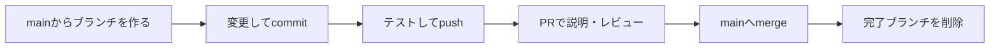

# GitHubの開発手順

変更を小さな単位で説明し、確認してから正式版へ取り込みます。面談では、完成した画面に加え、PRを使って課題・判断・検証の過程を示せます。

## 用語

| 用語 | このプロジェクトでの意味 |
| --- | --- |
| main | 確認を終えた変更を集める正式なブランチ |
| branch（ブランチ） | mainから分けた、今回の変更の作業場所 |
| commit（コミット） | ひとまとまりの変更に説明を付けて保存すること |
| push（プッシュ） | 手元のcommitをGitHubへ送ること |
| PR（プルリクエスト） | 変更理由・差分・確認結果をまとめ、mainへ取り込むための確認ページ |
| merge（マージ） | PRの変更をmainへ取り込むこと |

## 変更するときの流れ

1. **目的を決める。** 「回答できないときの案内を柔らかくする」など、確認できる改善をひとつにまとめます。大きな変更は独立して確認できる単位へ分けます。
2. **作業ブランチを作る。** mainを最新にし、`codex/short-description`のように内容が分かる名前を付けます。未完了の変更があれば、消さずに先に整理します。
3. **実装してcommitする。** 「何を、なぜ変えたか」が分かる説明を付けます。1行ごとに保存する必要はありません。意味のある修正がまとまった時点で記録します。
4. **変更に合った確認を行い、pushしてPRを作る。** PRテンプレートに目的・変更ファイル・挙動・検証結果・重点確認箇所を記載します。確認中ならDraft PRとして先に共有できます。
5. **レビューの指摘を扱う。** 指摘が妥当か判断し、対応する場合は同じブランチへ修正を追加します。PRは追加commitを反映します。人とAIのレビューは区別して記録します。
6. **確認済みの変更をmergeする。** 最新commitと確認結果を照合し、未解決の問題がなければSquash and mergeします。PR内の複数commitをmain上では1commitにまとめる方法です。mainを更新し、作業ブランチを削除します。次の変更には新しいブランチを使います。

ユーザーは課題、優先順位、仕様・見た目の判断を伝えます。AIは依頼範囲内で実装・確認・Git操作を進め、PRと結果を報告します。ユーザーが確認したいと指定したときはマージ前に止めます。新たな費用や公開範囲の変更などは別途本人が判断します。

## 検証の選び方

| 変更 | 確認の目安 |
| --- | --- |
| READMEや手順のみ | 差分、リンク、記載したコマンド・権限の整合 |
| 回答・検索・セキュリティ | 該当するコアテスト、型チェック、Workerビルド |
| UIや会話操作 | 該当するブラウザテスト、実画面、Workerビルド |
| AIモデル・検索品質 | 承認済みの評価データと予算を確認した実API評価 |

確認結果はPRへ記載します。「ローカルで通過」と「GitHub上の自動チェックで通過」を区別します。GitHub Actionsによる自動実行は現在導入していません。ローカルテストでは架空データを使い、実APIの評価は費用と送信範囲を確認してから行います。

コードに問題がある場合は、原因を直してから影響する確認を再実行します。文書だけの変更で、無関係な実API評価を繰り返す必要はありません。

## 個人情報と運用設定

`data/`、`docs/project_context/`、`wrangler.jsonc`、`.local/`、環境ファイル、認証情報はGitへ含めません。本文を除外していても、PR本文、画面画像、ログへ個人情報が混ざる場合があるため、共有前に確認します。設定は`wrangler.template.jsonc`、データは`examples/`のテンプレートだけを共有します。

コミットにはGitHubのnoreplyメールアドレスを使用します。共有済みの履歴をforce pushで書き換えません。取り込んだ変更を戻す場合も、新しいブランチとPRで取り消しを記録します。

## mainの保護と本番反映

2026-09-10の確認時点では、この非公開リポジトリでbranch protectionは利用できません。mainへの直接pushをGitHub側で強制的に禁止した状態ではなく、[AGENTS.md](../../AGENTS.md)とこの手順でPR運用を守ります。設定で強制する場合は、GitHubの対応プランを確認して本人が判断します。

mergeはソースコードをmainへ取り込む操作です。稼働中のアプリへ反映するデプロイは別の工程です。既に承認された範囲で影響と確認結果を照合して実施し、新たな課金・権限追加・公開範囲の拡大は事前に確認します。

## 面談で説明できる記録にする

PRごとに「どの問題に気づいたか」「なぜこの方法を選んだか」「何を確認したか」「何がまだできないか」が分かるようにします。本人の判断、AIによる実装、外部の人によるレビューがあれば、その分担も事実どおりに残します。

説明例：

> 課題の発見と要件・優先順位の判断、動作確認を自分が担当し、実装・検証・Git操作にAIを使っています。変更ごとにPRを作り、理由と確認結果を残す運用にしています。

これは説明の型です。実際に担当していない工程は自分の実績として話さないでください。初回のP0実装はまとめてGitへ登録しており、PR運用はこの手順の導入から始めます。過去のレビューや開発履歴を後から行ったことにはしません。

リポジトリは非公開です。面談相手へURLを渡すだけでは閲覧できないため、画面共有や、個人情報を除いた資料で見せる方法を選びます。リポジトリの公開化や他者の招待は、見せる範囲を決めてから本人が判断します。

参考：[GitHub flow](https://docs.github.com/en/get-started/using-github/github-flow)、[Squash and merge](https://docs.github.com/en/pull-requests/reference/pull-request-merges)、[ブランチ保護の対応プラン](https://docs.github.com/en/repositories/configuring-branches-and-merges-in-your-repository/managing-protected-branches/about-protected-branches)。
