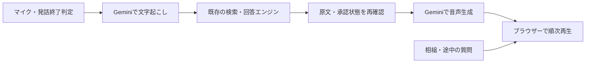

# 音声面談の開発版

文字面談と同じKnowledge・検索・回答エンジンに、音声の入出力を追加しています。初期設定では無効です。Phase 1の本人による確認と、Phase 2全体の受け入れはまだ完了していません。

## 動作

- 開始ボタンで初めてマイクを使用し、700msの無音または手動操作で発言を送ります。1回の発言は最大30秒、16kHz・mono・PCM16 WAVへ変換します。
- AIの発話中に声を検知すると再生を一時停止します。「はい」「なるほど」などの短い相槌なら続きから再生し、新しい質問なら以前の通信と再生予約を停止します。相槌の認識も音声APIの利用回数に含まれます。
- 検索・回答モデルの選択は文字版と共通です。音声認識・音声合成にはGoogleのGemini APIを使用します。音声用に別のRAGや自由な回答生成を作っていません。
- 文章と音声の送信直前、音声生成の開始前にもD1で公開状態を確認します。生成時に参照した根拠本文が変わった場合や承認が取り消された場合は、以後の送信を止めます。既に利用者へ届いた情報を後から取り消すことはできません。
- 補助音声「確認しますね。」を1回だけ使用し、回答音声が届いたら止めます。これは同梱の標準合成声で、実行時に追加のTTS APIを呼びません。
- 「声が届くまで」は、発話の終わりから回答音声が出力されるまでをブラウザーの音声クロックで計測します。補助音声は含みません。端末・ブラウザーによる推定誤差があります。
- 完了イベントを受信し、再生も終えた往復だけを次の質問の履歴へ含めます。停止・失敗した回答を履歴へ戻しません。
- 終了・画面非表示・離脱でマイク、再生、通信を止め、会話をメモリから破棄します。再開は新しい面談です。

## 音声会話の設計方針（2026-09-11）

**逐語一致はPhase 2の完成条件にしません。意味を保った自然な言い換えを許容します。** 数字・単位・時点・否定・条件・担当範囲、正式な肩書と実務、本人とチームの実績の区別は保ちます。語尾や語順を整えることはできますが、「支援した」を「主導した」にする、過去の数値を現在の実績として話す、但し書きを落とすことは許容しません。

現行の回答エンジンは、承認済み原文の段落を選び、ローカルの文字列照合を通してTTSへ渡す暫定方式です。この設計更新だけで、コードが自由な言い換えに対応したわけではありません。照合を外すだけでは意味を検証できず、言い換えを許しただけで速くなるとも言えません。追加の言い換え・校閲LLMを毎回答へ直列に挟む方式は採らず、会話モデルが音声生成の中で言い換える方式を比較対象にします。速さと意味の保持は、同じ質問・根拠で実測して判断します。

[OpenAIのGPT-Live prompting guide](https://developers.openai.com/api/docs/guides/live-prompting)から、次の点を会話設計と評価へ取り入れます。GPT-Live固有の設定を、現在のGemini TTSへそのまま渡すものではありません。

| 適用点 | 面談くんでの扱い |
| --- | --- |
| 音声側の指示を短くする | 日本語での役割・話し方・相槌・割り込み・検索への委譲に絞る。回答は短いまとまりを基本とし、必要な限定や但し書きは省かない。詳細な検索条件と回答検証は既存エンジンが担う。 |
| 結果を待って答える | 本人に関する回答は検索・承認確認を通した結果に基づく。待機中に職歴・意向・実績を推測しない。未確認の結果を取得済みとして話さない。 |
| 相槌を一律に禁止しない | 話を聞く短い反応と、質問への事実回答を分ける。誤った前提や条件への同意と受け取られる反応は避ける。現在の「確認しますね。」は待機の案内として維持する。 |
| 発話停止と処理中断を区別する | 現在の短い相槌なら再開する挙動を保ち、新しい質問・中止では古い回答の通信と再生予約を止める。会話モデル導入時も、停止指示だけでバックエンドの処理が消えたとは扱わない。 |

GPT-Liveの[client delegation](https://developers.openai.com/api/docs/guides/live-delegation)なら、Geminiと既存Knowledgeをバックエンドとして使う構成を検討できます。返却内容の言い換えは仕様上想定されていますが、それだけで意味の保持が保証されるわけではありません。また、[サーバー側制御の説明](https://developers.openai.com/api/docs/guides/voice-server-controls?api=live)にあるとおり、バックエンドの検証だけでは待機中の発話を含む音声全体を検証できません。プロンプト、発話内容、割り込み時の挙動を合わせて評価します。GPT-Liveへの切り替え・実API比較はまだ行っていません。

### Phase 2を進める順序

1. **待ち時間と会話方式を評価する。** 現方式の発話終了判定・STT・検索と回答・TTS・再生待ちの時間を分けて測り、GPT-Liveを含む会話方式と比較する。既存の短文実測ではSTTだけで約2.4秒、TTSの最初のPCM到着まで約1.8秒かかっており、逐語条件の緩和だけで1.5秒目標を達成できる根拠はない。この2つの値は別々の測定で、面談1往復の実測値ではない。
2. **意味と会話の自然さを同時に確認する。** 数字、否定、条件、肩書と実務、チームと個人の区別を含む同じ評価ケースを使う。相槌、質問の言い直し、停止、通信の遅れ、承認取り消しも確認する。First Audioは補助音声を除く回答の再生開始を測り、P50・P95と本人による聞きやすさの評価を分けて示す。
3. **本人声とセッションの安定性を詰める。** 声の利用条件を確認し、標準声との品質・速度を比較する。[OmniVoiceの実測](omnivoice-comparison.md)と長時間・端末差の確認も残る。映像の契約・実装はPhase 3で判断する。

## 設定

先に[文字版のセットアップ](../setup/README.md)を済ませます。回答がOpenAIやClaudeでも、音声用の`GEMINI_API_KEY`が必要です。キーはWorkers Secretsへ登録し、設定ファイルやブラウザーへ置きません。

共有テンプレートには次の設定があり、個別の設定はGit対象外の`wrangler.jsonc`の`vars`へ反映します。

| 設定 | 初期値・役割 |
| --- | --- |
| `VOICE_ENABLED` | `false`。有効にするときだけ`true` |
| `VOICE_STT_MODEL` | `gemini-3.5-transcribe` |
| `VOICE_TTS_MODEL` | `gemini-3.1-flash-tts-preview` |
| `VOICE_NAME` | `Kore`。標準合成声。本人の声ではない |
| `VOICE_DAILY_REQUEST_LIMIT` | `40`。音声認識・音声回答の合計。上限100 |
| `VOICE_IP_HOURLY_LIMIT` | `10`。IPごとの音声認識・音声回答の合計。上限30 |

通常の1往復は音声認識と音声回答で2回分です。音声回答には文字版の利用制限も適用します。入力・受信量、API出力token、実行時間にも上限を設けています。回答全体の音声は最大120秒ですが、長い回答はD1のクエリ上限や処理時間の上限でそれより早く停止する場合があります。

D1の無料枠を超えないよう、音声を先頭250ms・以後2秒までにまとめ、各送信直前の再照合を1 SQLで行います。前処理8 SQLを含め50件を上限として計数し、51件目を実行する前に停止して質問を分ける案内を表示します。テストでは30秒・4段落・Provider由来1,500フレームを、17音声イベント・合計41 SQLで省略なく送信できています。前処理へSQLを追加する場合は`lib/voice/answer.ts`の予約数も更新してください。

有効化後は`/voice`を開きます。ホームの音声入口は設定が有効なときだけ表示されます。HTTPSまたはlocalhost上のマイク・AudioWorklet対応ブラウザーが必要です。`/voice`だけマイク使用を許可するPermissions-Policyを設定しています。

新たな費用や公開範囲に影響する本番有効化は、管理者が確認してから行います。この変更では本番へのデプロイ・音声有効化・有料プランへの変更を行っていません。

## プライバシー

録音、文字起こし、会話本文、生成音声をアプリのDB・ログ・ブラウザーstorageへ保存しません。処理中のメモリは使用します。録音は文字起こしのため、検証済み回答文は音声生成のためGoogleへ送ります。質問・履歴・検索根拠の送信先は文字版の設定に従い、開始画面と説明ページに表示します。

音声APIのリクエストは`store:false`を指定し、Gemini Interactionsの会話保存を無効化します。外部サービスの運用上の保持・データ利用条件全般まで無効になるという意味ではありません。利用回数制限には本文を含まない匿名キー・回数・期限を保持します。

## 検証記録（2026-09-10）

`npm run check`はコア151件と型チェック、`npm run test:e2e`は文字版を含む29件、`npm run build:worker`はCloudflare向けのビルドが成功しました。ブラウザーテストのマイク入力は検証用の値か、同梱の合成音声だけです。独立したAIレビューで見つけた撤回時の文章送信、Abort後の送信、フレーム粒度、Factのハッシュ、再生再開待ち中の停止、上限案内の問題を修正し、回帰テストで確認しています。人による受け入れとは区別します。

個人情報を含まない短い合成音声で、既存Secretを表示せずに実APIを呼びました。本番DB・Vectorizeは一時preview内で無効な文字列bindingに置き換え、資料へのアクセスを防いでいます。本番デプロイは変更していません。

| 実APIの確認 | 結果 |
| --- | --- |
| 日本語TTS | 「確認しますね。」を1.72秒のPCM16・24kHz・mono音声として生成。43個のPCM deltaを受信 |
| TTSの最初のPCM到着 | 1,818ms。ブラウザーでの再生時刻ではなく、評価クライアントへの到着時刻 |
| TTSのstream完了 | 9,067ms |
| 生成WAVの日本語STT | 「確認しますね。」と一致。2,298ms |
| 実ブラウザーの収音・変換後のSTT | Chromeの偽マイクに上記の合成音声だけを投入。実AudioWorkletの発話終了判定・16kHz WAV変換を通した音声も「確認しますね。」と一致。STT 2,397ms |
| リクエスト形式 | 最初の2回はHTTP400。TTS専用の公式例に合わせ`response_format`を`{type:"audio"}`にしたリクエストで成功。形式の各フィールドと入力文の寄与は個別に切り分けていない |

これは短い合成音声の接続確認です。実マイク・雑音・長い会話での品質評価や、発話終了から最初の回答音声まで1.5秒という目標の達成を示す結果ではありません。TTSへ渡す文章は検証しますが、生成された声の読み間違い・省略まで機械的に保証するものではありません。

初回評価は0.10 USD以内、TTSは失敗を含め3回まで、STTは2回までとしました。成功したTTSのusageは入力5・出力86 tokens、2回のSTTは入力44と49・出力0 tokensです。[標準料金](https://ai.google.dev/gemini-api/docs/pricing)を当てはめた成功リクエストの合計概算は0.001911 USDです。請求確定額ではなく、失敗リクエストやCloudflareの料金は含めません。音声の秒数からの概算とAPIのusageが一致するとは限らないため、費用確認には実usageを使います。

## Phase 2の残る確認

| 仕様の項目 | 現状 |
| --- | --- |
| 音声認識・Streaming音声・既存Knowledgeの利用 | 実装済み。音声APIは上記の短文で確認。本人データとの総合的な音声QAは未完了 |
| 割り込み・相槌・発話終了判定 | 実装済み。ブラウザーの自動検証を用意。雑音や人の自然な会話による評価は未完了 |
| Filler・First Audio計測 | 実装済み。1.5秒以内の目標は未達 |
| 本人声候補 | 方式を調査。本人の参照音声を使った生成・比較・採用判断は未実施 |
| OmniVoice比較 | [公式資料による比較](omnivoice-comparison.md)を実施。重みの取得・実測は未実施 |
| LiveKit等での安定セッション | ブラウザーの録音・再生・通信を管理するセッションを実装。長時間・端末差・通信劣化の受け入れ確認とLiveKit接続は未実施 |

本人声やOmniVoiceの実測には、参照音声と利用条件の確認が必要です。モデルのダウンロード、追加ツールのインストール、GPUの準備は行っていません。Phase 3の映像はこの変更に含みません。

参考：[音声認識](https://ai.google.dev/gemini-api/docs/transcribe)、[Streaming TTS](https://ai.google.dev/gemini-api/docs/speech-generation#streaming-speech-generation)、[Interactions API](https://ai.google.dev/api/interactions-api)、[D1の制限](https://developers.cloudflare.com/d1/platform/limits/)。
