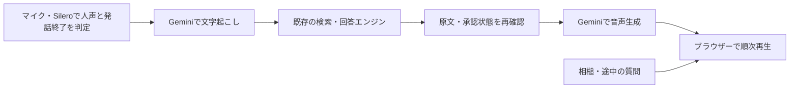

# 音声面談の開発版

文字面談と同じKnowledge・検索・回答エンジンに、音声の入出力を追加しています。初期設定では無効です。Phase 1の本人による確認と、Phase 2全体の受け入れはまだ完了していません。

## 動作



- 開始ボタンで初めてマイクを使用し、ブラウザー内のSilero VADで人声を判定します。声を検出した後、1,216msの非発話または手動操作で発言を送ります。続けて話した区間を含め、1回の発言の音声は累積最大30秒、16kHz・mono・PCM16 WAVへ変換します。
- 自動送信後も、回答要求を送る前に続きを検出したら前半の音声を保持し、古い文字起こしを無効化・中断します。続きの終端で前半と後半を結合して文字起こしし、全文だけを回答へ渡します。手動送信と30秒上限で確定した後や、回答要求を送った後の発言は連結しません。
- AIの発話中に声を検知すると再生を一時停止します。「はい」「なるほど」などの短い相槌なら続きから再生し、新しい質問なら以前の通信と再生予約を停止します。相槌の認識も音声APIの利用回数に含まれます。
- 音声生成は`buffered`が既定です。検証済みの文章を最大180文字ずつ生成し、その文章の音声全体を検証してから順番に再生へ渡します。Googleからの細かい音声deltaの到着を待って再生が途切れる状況を避けるための方式です。最初の声が出るまでは、その文章の生成完了を待ちます。従来の`streaming`は比較用に残しています。
- 音声認識には[公式の補助語彙](https://ai.google.dev/gemini-api/docs/transcribe#custom-vocabulary)として一般用語`AI`・`生成AI`と、その表記・読み方の補助`生成 AI`・`生成エーアイ`を指定します。認識結果の「愛」を文字列置換したり、本人資料や会話履歴を音声認識へ追加送信したりはしません。補助語彙は正しい認識を保証するものではありません。
- 検索・回答モデルの選択は文字版と共通です。音声認識・音声合成にはGoogleのGemini APIを使用します。音声用に別のRAGや自由な回答生成を作っていません。
- 文章と音声の送信直前、音声生成の開始前にもD1で公開状態を確認します。生成時に参照した根拠本文が変わった場合や承認が取り消された場合は、以後の送信を止めます。既に利用者へ届いた情報を後から取り消すことはできません。
- 文字起こしで内容が確定した後、挨拶を除く回答待ちでは補助音声「確認します」を1回だけ使用し、回答音声が届いたら止めます。これは同梱の標準合成声で、実行時に追加のTTS APIを呼びません。
- 「声が届くまで」は、発話の終わりから回答音声が出力されるまでをブラウザーの音声クロックで計測します。補助音声は含みません。端末・ブラウザーによる推定誤差があります。
- 完了イベントを受信し、再生も終えた往復だけを次の質問の履歴へ含めます。停止・失敗した回答を履歴へ戻しません。
- 別のタブで調べ物をするなど画面を隠しても、面談とマイクはそのまま続きます。待機中は認識エンジンが動き続けるため、戻ってそのまま話せます。終了操作とページの離脱（移動・閉じる）ではマイク、再生、通信を止め、会話をメモリから破棄します。

### MVPの応答時間を確認する

音声面談中の「応答時間の内訳」を開くと、直近の計測できた回答と、その面談のP50・P95・対象件数を確認できます。初期状態では閉じています。計測は追加APIを呼ばず、数値を回答本文・読み上げ・次の質問の履歴へ入れません。終了・再読み込みで会話と一緒に消去します。

| 表示 | ブラウザーで測る区間 |
| --- | --- |
| 発話終了待ち | 最後の有声音を検出してから録音の送信処理を始めるまで。手動送信も実際の待ち時間を使用 |
| 音声認識・通信 | WAV変換・送信開始から、文字起こしの結果を受け取るまで |
| 検索・回答・通信 | 文字起こしの結果受信から、最初の回答文を受け取るまで |
| 音声化・通信 | 最初の回答文から、最初の回答PCMを受け取るまで |
| 再生待ち | 最初の回答PCM受信から、出力デバイスでの再生開始推定時刻まで |

全区間は同じブラウザーの時計を使います。発話終了はSileroが最後の人声フレームを判定した時刻（手動録音では最後の収音ブロック到着時刻）、再生開始は音声クロックに基づく推定で、通信・公開状態の再照合・処理待ちも含みます。純粋なSTT・LLM・TTSの処理時間とは区別してください。合計は発話終了から回答音声までで、補助音声「確認します」を含めません。

正常終了イベントと音声の再生完了が揃った往復だけを集計します。アプリが回答中の途中発話を検出した場合、停止・失敗、未観測や逆転した時刻がある場合は集計対象外です。自動送信後のSTT中も続きの人声を判定しますが、小声・雑音などによる取りこぼしはあり得ます。音声を連結した場合は最後の区間の発話終了から測り、それ以前に中断したSTTの待ち時間は含みません。P50・P95はnearest-rank方式で、少数試行の値から1.5秒目標の達成や実環境の性能を判断しません。

ローカルの3000番ポートが別アプリで使用中なら、次のように同じポートを指定して起動・ブラウザーテストを行えます。`npm run dev`だけでは実APIのSecretやKnowledgeは設定されず、未設定時は音声を開始できません。

```sh
MENDAN_DEV_PORT=3100 npm run dev
# 別のターミナルで実行。架空データと偽マイクを使い、実APIは呼ばない。
MENDAN_DEV_PORT=3100 npm run test:e2e -- tests/browser/voice.spec.ts tests/browser/voice-detection.spec.ts --workers=1
```

実マイクでの受け入れでは、設定済みの環境で短い質問、続きの質問、相槌、途中の質問、明示停止、終了後のマイク停止を確認します。待ち時間に加え、固有名詞・数字・否定・担当範囲の聞き取りと回答の意味を本人が確認します。既定の利用上限は同一IPで、音声認識・回答それぞれ毎時10要求です。相槌も認識枠を消費します。429では自動収音を止め、画面の再開ボタンで操作を戻します。追加の実API評価は、回数・送信範囲・費用上限を確認してから行います。

### ブラウザー内の発話検出（2026-09-14）

`@ricky0123/vad-web` 0.0.30のSilero V5と`onnxruntime-web` 1.22.0を固定して使います。音量だけの判定を置き換え、Sileroの既定の陽性確率0.3・陰性確率0.25、陽性3フレーム（96ms）、直前256msの音声を保持する設定です。短い合成「うん」は4フレーム条件と高い陽性閾値で取りこぼしたため、既定の閾値・3フレームへ調整しました。32msのフレームごとの推論を直列化し、無効化・再開をまたぐ古い推論結果は受け付けません。継続区間は保持済み音声を引いた30秒の残り予算で確定し、長い未確定音は送信せず聞き取りを続けます。

中間休止で質問の後半を失わないよう、非発話の終端を704msから1,216msへ延ばしました。それを超す休止でも、STT待ちなど回答要求の送信前に人声が再開した場合は同じ発言へ連結します。声を検出するたびにAPIを呼ぶのではなく、続きの区間が終わった時だけ結合音声を再送します。自動再試行は行いません。中断したSTTも、外部サービスで既に処理された分の課金や利用枠まで取り消せる保証はありません。回答要求の送信後の長い休止をさかのぼって結合する処理は未対応です。

`npm run dev`とビルド前に、必要なモデル・WASM・JSとライセンス通知（合計約13.7MB、非圧縮）だけを`public/vad/`へ生成します。配信は同一オリジンで、発話判定のための音声送信はありません。`/voice`だけCSPに`wasm-unsafe-eval`を加え、WASMは単一スレッドで動作します。生成物はGitに含めず、依存固定とコピー処理から再生成できます。

読み込み失敗・20秒の準備タイムアウト・推論やWorkletの故障では、自動送信を止めて「録音を開始／発言を送る」に切り替えます。音量判定による自動送信には戻しません。マイク切断はモデル準備中も監視し、終了・画面離脱後の遅い読み込み・推論結果から面談を再開しません。

実SileroとChromeの偽マイクで、無音・高RMSの人工環境雑音・人工打鍵ではAPI要求がなく、同梱の合成声と短い「はい」「うん」で送信されることを確認しました。STT・回答APIはモックで、この確認による音声API課金はありません。実際の部屋の雑音・小声・端末差は未確認です。テレビや再生音声も人声に含まれるため、echo cancellationを維持し、必要に応じてイヤホンを使います。

## 音声会話の設計方針（2026-09-11）


**逐語一致はPhase 2の完成条件にしません。意味を保った自然な言い換えを許容します。** 数字・単位・時点・否定・条件・担当範囲、正式な肩書と実務、本人とチームの実績の区別は保ちます。語尾や語順を整えることはできますが、「支援した」を「主導した」にする、過去の数値を現在の実績として話す、但し書きを落とすことは許容しません。

現行の回答エンジンは、承認済み原文の段落を選び、ローカルの文字列照合を通してTTSへ渡す暫定方式です。自己紹介は経歴・活動を優先し、名前の質問には承認済み見出し内の名前と固有名詞一覧を照合して短く返します。この設計更新だけで、コードが自由な言い換えに対応したわけではありません。照合を外すだけでは意味を検証できず、言い換えを許しただけで速くなるとも言えません。追加の言い換え・校閲LLMを毎回答へ直列に挟む方式は採らず、会話モデルが音声生成の中で言い換える方式を比較対象にします。速さと意味の保持は、同じ質問・根拠で実測して判断します。

[OpenAIのGPT-Live prompting guide](https://developers.openai.com/api/docs/guides/live-prompting)から、次の点を会話設計と評価へ取り入れます。GPT-Live固有の設定を、現在のGemini TTSへそのまま渡すものではありません。

| 適用点 | 面談くんでの扱い |
| --- | --- |
| 音声側の指示を短くする | 日本語での役割・話し方・相槌・割り込み・検索への委譲に絞る。回答は短いまとまりを基本とし、必要な限定や但し書きは省かない。詳細な検索条件と回答検証は既存エンジンが担う。 |
| 結果を待って答える | 本人に関する回答は検索・承認確認を通した結果に基づく。待機中に職歴・意向・実績を推測しない。未確認の結果を取得済みとして話さない。 |
| 相槌を一律に禁止しない | 話を聞く短い反応と、質問への事実回答を分ける。誤った前提や条件への同意と受け取られる反応は避ける。現在の「確認します」は待機の案内として維持する。 |
| 発話停止と処理中断を区別する | 現在の短い相槌なら再開する挙動を保ち、新しい質問・中止では古い回答の通信と再生予約を止める。会話モデル導入時も、停止指示だけでバックエンドの処理が消えたとは扱わない。 |

GPT-Liveの[client delegation](https://developers.openai.com/api/docs/guides/live-delegation)なら、Geminiと既存Knowledgeをバックエンドとして使う構成を検討できます。返却内容の言い換えは仕様上想定されていますが、それだけで意味の保持が保証されるわけではありません。また、[サーバー側制御の説明](https://developers.openai.com/api/docs/guides/voice-server-controls?api=live)にあるとおり、バックエンドの検証だけでは待機中の発話を含む音声全体を検証できません。プロンプト、発話内容、割り込み時の挙動を合わせて評価します。GPT-Liveへの切り替え・実API比較はまだ行っていません。

### Phase 2を進める順序

1. **待ち時間と会話方式を評価する。** 現方式の発話終了判定・STT・検索と回答・TTS・再生待ちの時間を分けて測り、GPT-Liveを含む会話方式と比較する。既存の短文実測ではSTTだけで約2.4秒、TTSの最初のPCM到着まで約1.8秒かかっており、逐語条件の緩和だけで1.5秒目標を達成できる根拠はない。この2つの値は別々の測定で、面談1往復の実測値ではない。
2. **意味と会話の自然さを同時に確認する。** 数字、否定、条件、肩書と実務、チームと個人の区別を含む同じ評価ケースを使う。相槌、質問の言い直し、停止、通信の遅れ、承認取り消しも確認する。First Audioは補助音声を除く回答の再生開始を測り、P50・P95と本人による聞きやすさの評価を分けて示す。
3. **本人声とセッションの安定性を詰める。** 声の利用条件を確認し、標準声との品質・速度を比較する。[OmniVoiceの実測](omnivoice-comparison.md)と長時間・端末差の確認も残る。映像の契約・実装はPhase 3で判断する。

### LiveKit Agentsの比較検討（2026-09-12）

**[LiveKit Agents](https://github.com/livekit/agents)は、Phase 2で比較検討する価値がある。既存のKnowledge・検索・承認管理を残し、音声セッション部分だけを小さく比較試作する案を推奨する。本採用は未決定。**

- **期待する効果：** 現在自作している発話終了判定・相槌・割り込み・音声通信の一部を任せ、自然な会話や長時間・端末差・通信劣化への対応を改善できる可能性がある。[日本語対応の発話終了判定](https://docs.livekit.io/agents/logic/turns/turn-detector/)や[高度な割り込み制御](https://docs.livekit.io/agents/logic/turns/adaptive-interruption-handling/)には、モデル・配備先などの利用条件があるため、選ぶ構成で確認する。
- **速度の評価：** LiveKitへの通信切り替えだけで、現在のSTT・TTSの待ち時間が解消するとは判断しない。先に各区間を測り、ストリーミングSTTや音声対話モデルへの変更と、LiveKitによる改善を切り分ける。可能な範囲で同じモデル・質問・根拠を使って比較する。
- **比較する項目：** 補助音声を除くFirst AudioのP50・P95、相槌での誤停止、割り込み時の停止・再開、意味の保持、承認取り消し、通信劣化・長時間会話、会話当たりの総費用。本人声の品質は別途比較し、LiveKitの導入だけで達成したとは扱わない。
- **維持する境界：** 本人に関する回答は既存の検索・承認確認を通す。取り消し後の送信停止、中断した回答の履歴処理、会話の非保存を維持し、常時接続に合わせた接続時間・同時接続数・費用の制限を確認する。逐語一致を完成条件へ戻したり、毎回答へ追加の校閲LLMを直列に挟んだりしない。
- **導入負担：** [Agentの常駐実行環境](https://docs.livekit.io/deploy/custom/deployments/)が必要で、通常のCloudflare Workersへ依存を追加するだけでは動かない。公式[TypeScript版](https://github.com/livekit/agents-js)も候補にできる。[Cloudの料金・無料枠](https://livekit.io/pricing)と[録音・会話等の収集設定](https://docs.livekit.io/deploy/observability/insights/)を確認し、改善と運用負担を比較して採否を決める。

現時点では既存コードと公式資料による検討まで。LiveKitの導入・比較試作・実API評価は未実施で、日本語品質・速度・安定性の改善は未検証。次の会話方式の評価でこの候補を取り上げる。

### 映像追加時のHeyGen候補（2026-09-12）

音声MVPを先に完成させ、映像は次に追加する方針です。新規のHeyGen連携は[LiveAvatarの公式SDK](https://github.com/heygen-com/liveavatar-web-sdk)を候補にできます。FULLモードで`context_id`を指定しない[restricted mode](https://docs.liveavatar.com/docs/full-mode/configuration)なら、自律応答を止めたまま、文字起こしを既存の回答APIへ渡し、検証済みの返答を[指定文読み上げイベント](https://docs.liveavatar.com/docs/full-mode/events)で発声させる構成が可能です。既存Knowledgeを使う技術的な接続候補であり、現行の相槌後の再開・承認取り消し・非保存を同等に維持できるかは実装時の確認事項です。

映像の追加だけで現在の音声応答が速くなるとは判断しません。接続試作には[約1分・指定アバター限定のSandbox](https://docs.liveavatar.com/docs/sandbox-mode)が使えます。通常プランはセッション時間でcreditを消費するため、[現在の料金](https://www.liveavatar.com/)と必要な面談時間を合わせて判断します。契約・SDK導入・写真や本人声の送信・実接続は未実施です。

## 入力の音声認識を選ぶ（2026-09-15）

発話の区切り（Silero VAD）は共通のまま、文字にする方法だけを選べるようにしました。処理場所は画面へ常に表示し、回答の生成まで完全にローカルとは表現しません。

| 方式 | 処理場所 | 使える条件 | 外部へ送るもの |
| --- | --- | --- | --- |
| この端末で文字にする | 端末内 | `SpeechRecognition.available({langs:["ja-JP"],processLocally:true})`が`available`のとき。`downloadable`なら言語パックの追加を案内 | なし（文字にした質問は回答生成のため送信） |
| ブラウザーの認識を使う | 外部（ブラウザー提供元） | `available()`の答えによる。Safariなど`available()`が無い実装は`unknown`として提示 | 音声 |
| このアプリの認識を使う（従来） | 外部（Google） | 音声が有効な環境すべて | 音声 |
| 手入力で質問する | 端末内 | すべて | 文字だけ |

既定は、端末内が使えれば端末内、使えなければ従来の方式です。未対応の環境でも黙って音声を外部へ送ることはなく、利用者が選ぶまで切り替えません。

- 途中結果は画面へ表示するだけで、回答AIは起動しません。無音判定または「発言を送る」で発話を確定した後に、一度だけ送ります。
- 認識エンジンは待機中から動かし、発話の区切りだけをVADに合わせます。発話を検知してから開始すると、起動の待ち時間の分だけ最初の語が欠けます（2026-09-15に「自己紹介お願いします」が「紹介お願いします」となる実例で確認）。発話より前の確定結果は、区切りの時点で数え終わった結果として発話へ含めません。回答の再生中は認識を止め、待機へ戻るときに動かし直します。
- 従来方式（サーバーSTT）は、VADが発話開始の256ms前から切り出すため、頭の語は音声に含まれます。
- 使用中のマイク名（音声トラックの`label`）を画面に表示します。処理場所（端末内・外部）とは別の情報で、マイクの許可の後だけ取得できます。
- `isFinal`はその結果の確定であり、質問全体の終わりではありません。複数の確定結果は同じ発話として蓄積します。`onend`は送信の合図に使いません。
- 発話ごとのIDで二重送信を防ぎ、中断・方式切替の後に遅れて届いた結果は表示にも送信にも使いません。
- 端末内を選ぶときは`processLocally = true`を明示します。マイクの許可と端末内処理は別で、言語パックが無ければ`language-not-supported`になり、クラウドへは切り替えません。
- 言語パックは、案内を読んだ利用者が「日本語の言語パックを追加する」を押した時だけ`install({langs:["ja-JP"],processLocally:true})`を呼びます。自動ではダウンロードしません。`processLocally`を渡さないと、Chromeは何もせず`false`を返します（2026-09-15に実機で確認。`true`を渡すとこのMacのChromeで10.4秒で完了し、`available`が`available`へ変わった）。ダウンロード中は`available()`が`downloading`を返すため、その状態を画面へ出して再確認できます。
- 自動の聞き分けが使えない場合、端末内・クラウド認識では認識器が聞き続け、利用者が「発言を送る」で区切ります。従来方式は録音ボタンで区切ります。
- 認識を続けられない失敗は、面談の完了とは区別し、理由を示して方式を選び直してもらいます。一度失敗した方式も選び直せますが、失敗の直後は別の方式を既定にします。黙って別の方式へ切り替えることはしません。
- 言語パックを追加できないブラウザーでは、再試行だけを促さず、ほかの方法を選ぶよう案内します。

計測は「初回の準備」（開始から発話待ちになるまで。マイクの許可と言語モデル・言語パックの準備を含む）と「発話終了→文字確定」（無音判定または送信操作から、確定した文字が決まるまで）を分けます。応答時間の内訳にも方式と初回準備を表示します。

### PCとiPhoneでの比較手順

1. 同じ3つの質問を用意します（例：チームでの担当範囲、2022年と2024年の売上、苦手なこと）。
2. PC（Chrome）で各方式を選び、3往復します。端末内は言語パックの追加後に測ります。
3. iPhone（Safari）で選べる方式を3往復します。`available()`が無い端末では端末内を選べないため、クラウド認識・従来方式・手入力を比べます。
4. 「応答時間の内訳」の初回準備と発話終了→文字確定、認識の誤り（言い直し・固有名詞・数字）を記録します。
5. 少数試行なのでP50・P95を主張に使わず、誤りは元の音声と確定文字を並べて人が判定します。 比較の途中で調べ物をする場合も、画面を離れただけなら面談は続きます（戻ると再開します）。

自動テストの認識は偽のWeb Speech APIを使うため、実エンジンの認識精度は測っていません。PCとiPhoneの実機比較は未実施で、既定方式はその結果を見て決めます。大きなモデルを利用者へダウンロードさせる方式も、この比較の後で判断します。

## 設定

先に[文字版のセットアップ](../setup/README.md)を済ませます。回答がOpenAIやClaudeでも、音声用の`GEMINI_API_KEY`が必要です。キーはWorkers Secretsへ登録し、設定ファイルやブラウザーへ置きません。

共有テンプレートには次の設定があり、個別の設定はGit対象外の`wrangler.jsonc`の`vars`へ反映します。

| 設定 | 初期値・役割 |
| --- | --- |
| `VOICE_ENABLED` | `false`。有効にするときだけ`true` |
| `VOICE_STT_MODEL` | `gemini-3.5-transcribe` |
| `VOICE_TTS_MODEL` | `gemini-3.1-flash-tts-preview` |
| `VOICE_TTS_MODE` | `buffered`。未指定も同じ。`streaming`で従来のdelta受信へ戻せる。その他の値は設定エラー |
| `VOICE_NAME` | `Kore`。標準合成声。本人の声ではない |
| `VOICE_DAILY_REQUEST_LIMIT` | `40`。音声認識・音声回答の合計。上限100 |
| `VOICE_IP_HOURLY_LIMIT` | `10`。IPごとの音声認識・音声回答の合計。上限30 |

通常の1往復は音声認識と音声回答で2回分です。音声回答には文字版の利用制限も適用します。入力・受信量、API出力token、実行時間にも上限を設けています。回答全体の音声は最大120秒ですが、長い回答はD1のクエリ上限や処理時間の上限でそれより早く停止する場合があります。

D1の無料枠を超えないよう、音声を先頭250ms・以後4秒までにまとめ、各送信直前の再照合を1 SQLで行います。前処理8 SQLを含め50件を上限として計数し、51件目を実行する前に停止して質問を分ける案内を表示します。テストでは60秒・4段落を17音声イベント・合計41 SQL、90秒・4段落を25音声イベント・合計49 SQLで省略なく送信できています。ブラウザー側も4秒分のPCMを収める300,000文字のSSE上限に対応し、途中で分断された大きなフレームを復元します。前処理へSQLを追加する場合は`lib/voice/answer.ts`の予約数も更新してください。

有効化後は`/voice`を開きます。ホームの音声入口は設定が有効なときだけ表示されます。HTTPSまたはlocalhost上のマイク・AudioWorklet対応ブラウザーが必要です。`/voice`だけマイク使用を許可するPermissions-Policyを設定しています。

新たな費用や公開範囲に影響する本番有効化は、管理者が確認してから行います。この変更では本番へのデプロイ・音声有効化・有料プランへの変更を行っていません。

## プライバシー

以下は通常の公開版の動作です。本人が記録を依頼したローカル検証では、次節の専用proxyを経由して会話と音声を保存します。

録音、文字起こし、会話本文、生成音声をアプリのDB・ログ・ブラウザーstorageへ保存しません。処理中のメモリは使用します。録音は文字起こしのため、検証済み回答文は音声生成のためGoogleへ送ります。質問・履歴・検索根拠の送信先は文字版の設定に従い、開始画面と説明ページに表示します。

buffered方式も生成音声を処理中のメモリで扱い、保存しません。完了状態・使用量・全音声の形式と容量を確認してから再生経路へ渡します。JSONは実受信3.5MB、PCMは既存上限で制限し、読み上げ途中の中断・送信直前の承認確認も維持します。自動再試行や他方式への自動切り替えは行いません。

音声APIのリクエストは`store:false`を指定し、Gemini Interactionsの会話保存を無効化します。外部サービスの運用上の保持・データ利用条件全般まで無効になるという意味ではありません。利用回数制限には本文を含まない匿名キー・回数・期限を保持します。

## ローカル検証の会話保存

検証用アプリを `127.0.0.1:8789` で起動し、別のターミナルで `npm run preview:record` を実行すると、記録付きの入口が `http://127.0.0.1:8788` になります。既存プレビューのOrigin許可は入口の8788に合わせます。別ポートを使う場合は `-- --port <入口> --upstream-port <アプリ>` を指定します。公開版にはこのproxyを置きません。

画面の「検証記録をこのMacに保存中」を確認してから面談を始めます。記録先はGit対象外の `.local/conversation-recordings/<起動ID>/sessions/<タブID>/` です。会話終了・画面移動・再読み込みで保存済みファイルを削除しません。以前の未保存会話は復元できません。

| 保存対象 | ファイルと用途 |
| --- | --- |
| 質問、文字起こし用WAV、API応答全文 | `requests/<ID>/request.raw` と `response.raw`。途中停止時も受信済み部分を保持 |
| 聞き取り結果・回答・エラー・所要時間 | 各requestの `summary.json` と `meta.json` |
| AIから受信した回答音声 | `received-audio.wav`。実際に最後まで再生したことを意味しない |
| マイクの連続音声 | `microphone/<ID>/microphone.webm` または `.mp4`。開始から終了まで、聞き取りへ送られなかった区間も保存 |
| 画面の発言・エラー・再生開始／一時停止／中断・応答時間 | `events.ndjson`。タブID、回答ID、時刻で対応を追う |

マイク音声は約1秒ごとのpartを保存し、終了時に結合します。ブラウザーの強制終了や通信切断では、未送信の末尾や終了通知が欠ける場合があります。終了通知が欠けた場合は、停止意図を受信できた範囲で `microphone.partial.webm`／`.mp4` と `partial-manifest.json` を作り、不完全な記録として残します。停止意図も届かない場合でも受信済みpartは残ります。保存失敗を検知した画面は面談を停止し、再読み込みまでエラーを保持します。

proxyはloopback限定で、書き込みのHost・Originを照合します。会話ファイルをHTTPで読む機能はありません。認証ヘッダーは記録せず、記録先のディレクトリーは0700、ファイルは0600です。新たなクラウド保存先や外部APIは使いません。会話は公開用資料へ自動追加せず、保存期限による自動削除も行いません。

## 検証記録（2026-09-10）

`npm run check`はコア151件と型チェック、`npm run test:e2e`は文字版を含む29件、`npm run build:worker`はCloudflare向けのビルドが成功しました。ブラウザーテストのマイク入力は検証用の値か、同梱の合成音声だけです。独立したAIレビューで見つけた撤回時の文章送信、Abort後の送信、フレーム粒度、Factのハッシュ、再生再開待ち中の停止、上限案内の問題を修正し、回帰テストで確認しています。人による受け入れとは区別します。

個人情報を含まない短い合成音声で、既存Secretを表示せずに実APIを呼びました。本番DB・Vectorizeは一時preview内で無効な文字列bindingに置き換え、資料へのアクセスを防いでいます。本番デプロイは変更していません。

| 実APIの確認 | 結果 |
| --- | --- |
| 日本語TTS | 「確認しますね。」を1.72秒のPCM16・24kHz・mono音声として生成。43個のPCM deltaを受信 |
| TTSの最初のPCM到着 | 1,818ms。ブラウザーでの再生時刻ではなく、評価クライアントへの到着時刻 |
| TTSのstream完了 | 9,067ms |
| 生成WAVの日本語STT | 「確認しますね。」と一致。2,298ms |
| 実ブラウザーの収音・変換後のSTT | Chromeの偽マイクに上記の合成音声だけを投入。実AudioWorkletの発話終了判定・16kHz WAV変換を通した音声も「確認しますね。」と一致。STT 2,397ms |
| リクエスト形式 | 最初の2回はHTTP400。TTS専用の公式例に合わせ`response_format`を`{type:"audio"}`にしたリクエストで成功。形式の各フィールドと入力文の寄与は個別に切り分けていない |

これは短い合成音声の接続確認です。実マイク・雑音・長い会話での品質評価や、発話終了から最初の回答音声まで1.5秒という目標の達成を示す結果ではありません。TTSへ渡す文章は検証しますが、生成された声の読み間違い・省略まで機械的に保証するものではありません。

初回評価は0.10 USD以内、TTSは失敗を含め3回まで、STTは2回までとしました。成功したTTSのusageは入力5・出力86 tokens、2回のSTTは入力44と49・出力0 tokensです。[標準料金](https://ai.google.dev/gemini-api/docs/pricing)を当てはめた成功リクエストの合計概算は0.001911 USDです。請求確定額ではなく、失敗リクエストやCloudflareの料金は含めません。音声の秒数からの概算とAPIのusageが一致するとは限らないため、費用確認には実usageを使います。

## 音声MVPの追加評価（2026-09-12）

既存のGoogle環境と承認済みKnowledgeを使い、一時プレビューで総合評価を進めました。入力はインストール済みの日本語合成声で、ブラウザーのAudioWorklet・WAV変換以降は実装と実APIを通しています。人の実マイク・聞きやすさの受け入れとは区別します。本番デプロイは行っていません。

従来のstreaming方式では文字起こしが成功した一方、回答音声の生成が遅く、2回ともブラウザーの90秒制限で中断しました。1回の追加診断では、119文字に対する音声生成開始から完了イベントまで約91.7秒、音声は約21.3秒分でした。2秒分の音声が届く間隔は約8.4秒で、出力usageも指定した1024を超える1066 tokensだったため、既存の検証で失敗として終了しました。この観測を一般的なGoogle APIの性能値とは扱いません。

同じ短文「確認しますね。」をnonstreamで1回だけ比較すると、1.76秒分の音声を約3.3秒で受信できました。先行のstreaming試行は1.72秒分を約9.1秒で受信しています。別時点で生成音声も異なるため、速度の改善率は断定しません。[公式に対応するnonstream TTS](https://ai.google.dev/gemini-api/docs/speech-generation)を使い、文章単位の生成・検証後に再生へ渡す方式をMVPの既定に変更しました。上限検証を緩めたり、回答を途中で省略したりしていません。nonstreamの返却MIMEには付加情報が含まれるため、`audio/l16`の`codec=pcm`・`rate=24000`・`channels=1`に限って受け付けます。別の形式や矛盾する指定は拒否します。

bufferedへの変更後、約1分の回答でD1の照合回数上限に達する問題も確認しました。後続音声を4秒ずつ送るように変更し、各送信前の承認確認を残したまま、必要な照合回数を減らしています。120秒の音声上限・50 SQL上限・TTSの出力usage上限は維持し、上限超過は途中の成功として扱いません。

### 通し確認の結果

同じブラウザーの面談で3往復が正常終了し、各回の音声再生後に次の発言を受け付けました。後続のAPI要求には、完了した会話が2件・4件の履歴として入っています。終了後は画面から会話が消え、localStorage・sessionStorageはいずれも0件でした。

| 合成入力のケース | 回答音声まで | 認識と回答の確認 |
| --- | --- | --- |
| 職歴を尋ねる | 17.86秒 | 質問の文字起こしが一致し、回答を再生完了 |
| 前の回答を受けて担当を尋ねる | 22.00秒 | 「二つ目」が「前の」に変わって認識された。認識後の質問に回答し、再生は完了したが、質問の意味を保てた検証には不合格 |
| AI活用を尋ねる | 12.71秒 | 「AI」を「愛」と認識し、情報がない旨の返答を再生。認識精度の課題として記録し、補助語彙を追加 |

この3件のP50は17.86秒、P95は22.00秒です。誤認識した質問への返答も含む再生完了ケースの時間で、正しい回答率を示すものではありません。元の合成入力は、同じ日本語音声・速度・入力文で再生成したPCMとの一致を確認しています。人の自然な声や雑音下の精度は未検証です。

通し確認のGoogle API使用量に[標準料金](https://ai.google.dev/gemini-api/docs/pricing)を当てはめた概算は0.089093 USDです。請求確定額ではなく、これ以前の切り分け試行や後続の補助語彙確認、Cloudflare料金は含みません。タイムアウトした試行は最終usageを回収できていない場合があり、回収済みusageの合計を請求総額とは扱いません。

補助語彙`AI`の追加後は、同じAI活用の合成音声を1回だけ再評価しました。質問の認識が一致し、162文字の回答音声を再生完了しました。回答音声までは22.52秒、使用量からの概算は0.019844 USDでした。1件の確認で一般的な認識精度の改善は断定せず、「二つ目」が「前の」に変わった問題も未解決として残します。

型チェック・コア170件、4秒PCMの分断・再生・次問履歴を確認する追加ブラウザーテスト1件、Workerビルドが成功しました。bufferedの不正応答・容量・Abortと、既存streamingの検証も通過しています。独立したAIレビューで指摘されたSSE終端の分断境界も修正済みです。

## 補助音声の変更（2026-09-15）

待機中の補助音声を「確認しますね。」から「確認します」へ変更しました。同梱の`public/audio/checking.wav`を標準合成声（Kore、buffered）で作り直しています。

| 確認 | 結果 |
| --- | --- |
| 生成音声 | 24kHz・mono・PCM16、1.6秒、1チャンク |
| 生成WAVの日本語STT | 「確認します。」と一致 |
| 推定費用 | TTS 0.001043 USD、STT 0.000082 USD（同じ単価の仮定。確定請求額ではない） |

短文1回の接続確認であり、実マイクや長い会話での聞き取りを確認したものではありません。画面の表示文言ではなく、記録イベントの`text`と同梱音声を更新しています。

## Phase 2の残る確認

| 仕様の項目 | 現状 |
| --- | --- |
| 音声認識・音声生成・既存Knowledgeの利用 | 実装済み。入力は端末内・ブラウザーのクラウド・従来のサーバー・手入力から選べ、[方式の選び方](#入力の音声認識を選ぶ2026-09-15)を記録。buffered方式で実APIの3往復・再生・履歴を確認。質問の意味が変わる誤認識があり、PCとiPhoneでの速さ・日本語精度の比較と人による総合QAは未完了 |
| 割り込み・相槌・発話終了判定 | 実装済み。ブラウザーの自動検証を用意。雑音や人の自然な会話による評価は未完了 |
| Filler・First Audio計測 | 実装済み。1.5秒以内の目標は未達 |
| 本人声候補 | 方式を調査。本人の参照音声を使った生成・比較・採用判断は未実施 |
| OmniVoice比較 | [公式資料による比較](omnivoice-comparison.md)を実施。重みの取得・実測は未実施 |
| LiveKit等での安定セッション | ブラウザーの録音・再生・通信を管理するセッションを実装。LiveKitは比較検討する価値があると評価し、[音声セッション部分の比較方針](#livekit-agentsの比較検討2026-09-12)を記録。本採用・比較試作・接続と、長時間・端末差・通信劣化の受け入れ確認は未完了 |

本人声やOmniVoiceの実測には、参照音声と利用条件の確認が必要です。モデルのダウンロード、追加ツールのインストール、GPUの準備は行っていません。Phase 3の映像はこの変更に含みません。

参考：[音声認識](https://ai.google.dev/gemini-api/docs/transcribe)、[Streaming TTS](https://ai.google.dev/gemini-api/docs/speech-generation#streaming-speech-generation)、[Interactions API](https://ai.google.dev/api/interactions-api)、[D1の制限](https://developers.cloudflare.com/d1/platform/limits/)。
